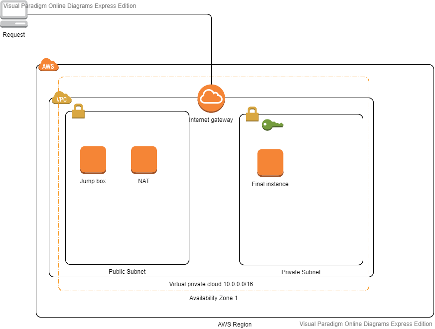
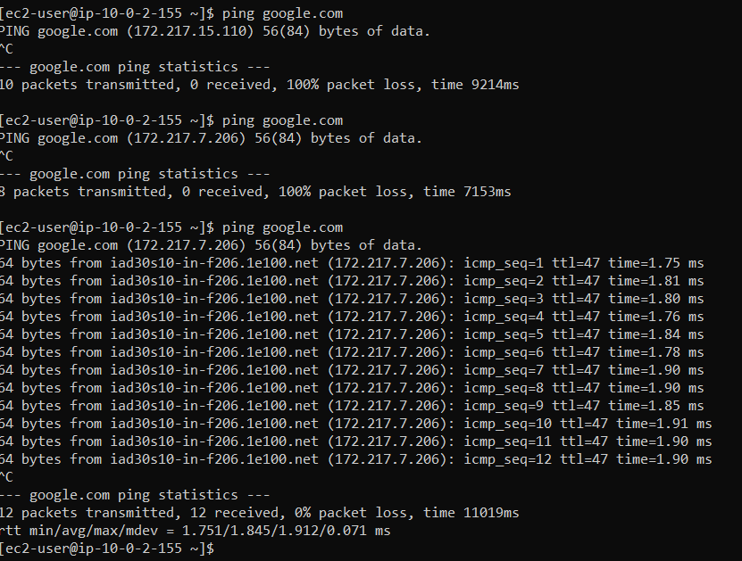

# Jumpbox-setup-on-AWS-Cloud
Jumpbox setup on AWS Cloud

**Objective**: Build and setup a Jumpbox (public EC2 instance) to access a private EC2 instance located in a private subnet with no direct access to Internet.

## Environment requirements
1 VPC
2 subnets (1 **public** and 1 **private**) in one Availability Zone
1 **Internet Gateway** associated with the public subnet
3 Amazon EC2 instances (**Jumpbox, NAT, FI (Final Instance**)
2 Elastic IP (EIPs) (one for each instance in the public subnet)
2 Route tables (one for each subnet)
3 Security groups (one for each instance)

## Architecture

 

## Steps to create the architecture

### VPC
Create a VPC with **/16** IPv4 CIDR block.

### Subnets
Create two subnets linked to the VPC with **/24** IPv4 CIDR block within one AZ:

One public subnet which will be routed to the Internet
One private subnet which will NOT have direct access to the Internet

### Internet Gateway
Create an Internet Gateway and attach it to the VPC.

### EC2 instances

Create 3 instances:

**Jumpbox (public)** type Amazon Linux 2 AMI HVM

**NAT instance (public)** amzn-ami-vpc-nat community AMI and disable Change Source/Dest. Check (Actions > Networking > Change Source/Dest. Check > Yes, Disable)

**Final Instance (private)** type Amazon Linux 2 AMI HVM

## Elastic IPs

Create **2 Elastic IPs** and assign each of them to the 2 instances in the public subnet: **Jumpbox** and **NAT instance**.

## Route Tables

Create 2 Route Tables:

## Security Groups
Create 3 Security Groups and associate each one to its corresponding instance:

### Jumpbox Security Group:

Inbound rules:
Allow inbound SSH from 0.0.0.0/0

Outbound rules:
Allow outbound all traffic

### NAT instance Security Group:

Inbound rules:
* Allow all ICMP (ping from local)
* HTTP - TCP - port 80 to IP address of the private subnet
* SSH - TCP - port 22  to IP address of the private subnet
* HTTPS TCP - port 443  to IP address of the private subnet

Outbound rules:
All traffic 0.0.0.0/0

## Final Instance Security Group:

Inbound rules:
Allow SSH from local

Outbound rules:
Allow all outbound traffic

# Test connection on Ubuntu console:

SSH connection (copying ssh key to Jumbox)

copy file using:
scp -i key.pem key.pem ec2-user@<Jumbox IP>:key.pem

Connect to Jumpbox:
ssh -i key.pem ec2-user@<JumpBox IP>

From JB, connect to Final instance
ssh -i key.pem ec2-user@<FI IP>

## Run test via pinging google.com
ping google.com

